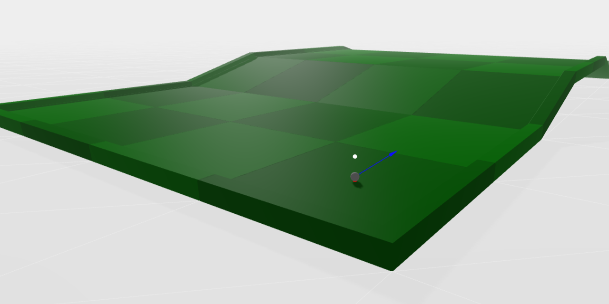

# Mini-Golf

Growing up in the early 2000s meant playing a variety of browser games. From classic Flash-based game platforms like Miniclip and Nitrome, to social games like Buddy Poke and Happy Harvest on Orkut; or Cafe Mania and Mini Fazenda on Facebook.

So I thought: why not try to create something with a similar feel to what existed at the time?

Thus, this project was born.

The project can be viewed at https://viniciusgoncalves00.github.io/mini-golf/
